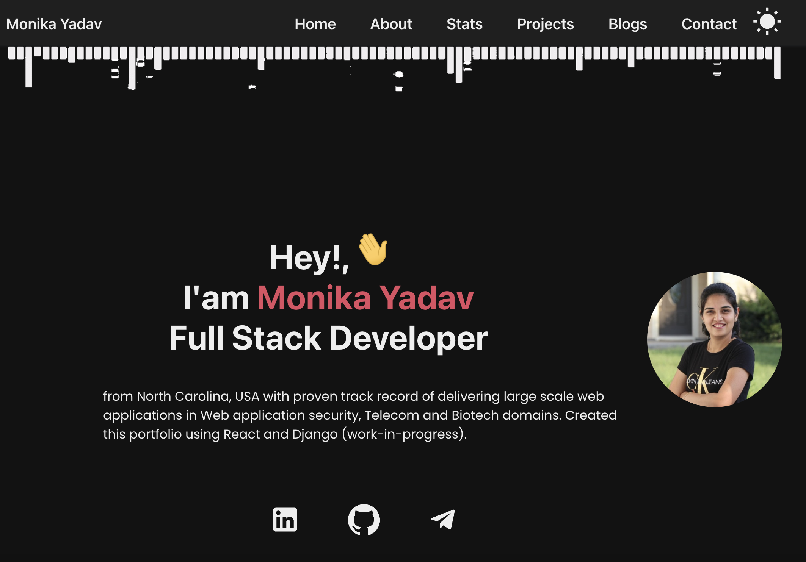

# Blog And Portfolio ✨

This repo is my Portfolio built using React and Django Rest Framework. (Depolyment to cloud is yet to finish)

This repo has divided into two folders. 
1. [Frontend](#Frontend)
2. [Backend](#Backend)

Clone the branch.
> `git clone <remote-repo-url>`

## Frontend ⚛️

### Setup

1. Install all the npm packages. 

   > `npm install`

   Note: React v18+ doesnot support current version of material UI. So to install all dependencies use below command
   
   > `npm install --legacy-peer-deps`

3. Run the code
   > `npm start`

## Backend

### Setup

1. Create a virtual environment and Install the pip packages in the requiremets.txt

   > `pip install -r requirements.txt`

   In case you are using version 3 use pip3
2. Run the server
   > `python manage.py runserver 9000`

## Author ✍️

[Monika](https://www.Github.com/moniydv)
